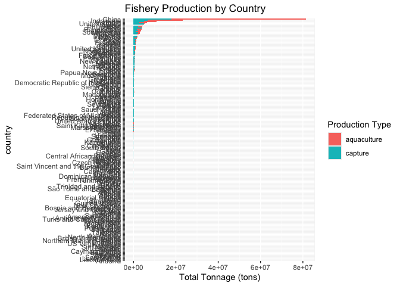
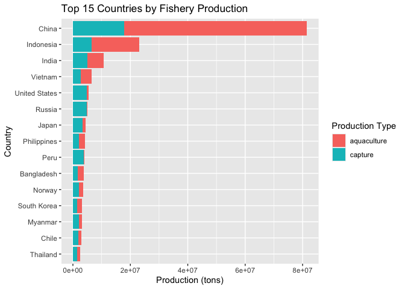

Lab 06 - Ugly charts and Simpson’s paradox
================
Zi Li
Feb 23, Due Feb 26

### Load packages and data

``` r
library(tidyverse) 
library(dsbox)
library(mosaicData) 

library(usethis)
use_git_config(
  user.name = "Zi-Nicole-Li",
  user.email = "lzcr0203@gmail.com"
)

#I use my Gmail for my github account.
```

### Exercise 1

``` r
staff <- read_csv("data/instructional-staff.csv")
```

    ## Rows: 5 Columns: 12
    ## ── Column specification ────────────────────────────────────────────────────────
    ## Delimiter: ","
    ## chr  (1): faculty_type
    ## dbl (11): 1975, 1989, 1993, 1995, 1999, 2001, 2003, 2005, 2007, 2009, 2011
    ## 
    ## ℹ Use `spec()` to retrieve the full column specification for this data.
    ## ℹ Specify the column types or set `show_col_types = FALSE` to quiet this message.

``` r
staff_long <- staff %>%
  pivot_longer(cols = -faculty_type, names_to = "year") %>%
  mutate(value = as.numeric(value))

staff_long
```

    ## # A tibble: 55 × 3
    ##    faculty_type              year  value
    ##    <chr>                     <chr> <dbl>
    ##  1 Full-Time Tenured Faculty 1975   29  
    ##  2 Full-Time Tenured Faculty 1989   27.6
    ##  3 Full-Time Tenured Faculty 1993   25  
    ##  4 Full-Time Tenured Faculty 1995   24.8
    ##  5 Full-Time Tenured Faculty 1999   21.8
    ##  6 Full-Time Tenured Faculty 2001   20.3
    ##  7 Full-Time Tenured Faculty 2003   19.3
    ##  8 Full-Time Tenured Faculty 2005   17.8
    ##  9 Full-Time Tenured Faculty 2007   17.2
    ## 10 Full-Time Tenured Faculty 2009   16.8
    ## # ℹ 45 more rows

``` r
staff_long %>%
  ggplot(aes(
    x = year,
    y = value,
    group = faculty_type,
    color = faculty_type
  )) +
  geom_line(linewidth = 1.1) + 
  labs(
    title = "Trends in Instructional Staff Employment"
  ) +
  theme_minimal()
```

<!-- -->

``` r
# then, I will show that the proportion of part-time faculty have gone up over time compared to other instructional staff types.
# to do that, I would need to highlight how part-time faculty increase over time, I would need to made their line thicker. 

staff_long %>%
  mutate(highlight = if_else(faculty_type == "Part-Time Faculty", "Part-Time Faculty", "Other")) %>%
  ggplot(aes(
    x = year,
    y = value,
    group = faculty_type,
    color = highlight,
    alpha = highlight,
    linewidth = highlight
  )) +
  geom_line() +
  scale_color_manual(values = c("Part-Time Faculty" = "red", "Other" = "black")) +
  scale_alpha_manual(values = c("Part-Time Faculty" = 1, "Other" = 0.4)) +
  scale_linewidth_manual(values = c("Part-Time Faculty" = 1.5, "Other" = 1)) +
  labs(
    title = "Increase in Part-Time Faculty Employment",
    x = "Year",
    y = "value",
    color = "Faculty Type"
  ) +
  theme_minimal() 
```

<!-- -->

``` r
# In a ggplot2 tutorial, I found out how to make one of my lines different from the others. the link is here: https://www.rdocumentation.org/packages/ggplot2/versions/0.9.1/topics/scale_colour_manual.
```

### Exercise 2

``` r
# maybe we can use horizontal bar charts for easier comparison and clarity. 

fisheries <- read_csv("data/fisheries.csv")
```

    ## Rows: 216 Columns: 4
    ## ── Column specification ────────────────────────────────────────────────────────
    ## Delimiter: ","
    ## chr (1): country
    ## dbl (3): capture, aquaculture, total
    ## 
    ## ℹ Use `spec()` to retrieve the full column specification for this data.
    ## ℹ Specify the column types or set `show_col_types = FALSE` to quiet this message.

``` r
fisheries
```

    ## # A tibble: 216 × 4
    ##    country             capture aquaculture  total
    ##    <chr>                 <dbl>       <dbl>  <dbl>
    ##  1 Afghanistan            1000        1200   2200
    ##  2 Albania                7886         950   8836
    ##  3 Algeria               95000        1361  96361
    ##  4 American Samoa         3047          20   3067
    ##  5 Andorra                   0           0      0
    ##  6 Angola               486490         655 487145
    ##  7 Antigua and Barbuda    3000          10   3010
    ##  8 Argentina            755226        3673 758899
    ##  9 Armenia                3758       16381  20139
    ## 10 Aruba                   142           0    142
    ## # ℹ 206 more rows

``` r
fisheries_data <- fisheries %>%
  pivot_longer(cols = c(capture, aquaculture),
               names_to = "Type",
               values_to = "Tonnage")
fisheries_data %>%
  ggplot(aes(x = reorder(country, Tonnage), y = Tonnage, fill = Type)) +
  geom_col() +
  coord_flip() +
  labs(title = "Fishery Production by Country",
       x = "country",
       y = "Total Tonnage (tons)",
       fill = "Production Type") +
  theme_minimal()
```

<!-- -->

``` r
# Nah... the above method made my bar charts all aggregated and it's impossible to see how each country is distributed.
# maybe I need to try a different plot.
# Nah, still not working, they all aggregated together. I may need to filter out the top country. I use top 15 countries. 

top15_fisheries <- fisheries %>%
  mutate(total = capture + aquaculture) %>%
  arrange(desc(total)) %>% 
  slice_head(n = 15) %>%
  pivot_longer(cols = c(capture, aquaculture),
               names_to = "type",
               values_to = "production")
# the above calculate my top 15 countries. 

top15_fisheries %>%
  ggplot(aes(x = production, y = fct_reorder(country, production), fill = type)) +
  geom_col() +
  labs(
    title = "Top 15 Countries by Fishery Production",
    x = "Production (tons)",
    y = "Country",
    fill = "Production Type"
  ) +
  theme_minimal()
```

<!-- -->

``` r
# It works!! Many thanks for this guide: https://r-graph-gallery.com/web-horizontal-barplot-with-labels-the-economist.html.
# and also for this guy's dplyr tutorials: https://dplyr.tidyverse.org/reference/slice.html
```

### Exercise 3

…

Add exercise headings as needed.
